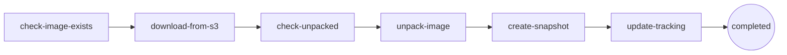

import Callout from '../../components/Callout.astro';
import { Tweet } from '@astro-community/astro-embed-twitter';

## How I Got Here

A fly.io take-home is what dropped this on my desk. Without that excuse, I would probably have kept happily typing `docker run` for another year. The take-home is the reason I learned this — but the learning itself is portable, which is what this post is about.

The shape of the work was small. Roughly: pull a container image from S3, unpack it into a devicemapper thinpool, snapshot the thin volume to "activate" it, track everything in SQLite, and drive the whole thing with the [FSMv2 library](https://github.com/superfly/fsm) that powers `flyd`. Hostile-environment assumptions throughout.

I passed and moved to the next round. So this is not a war story about failure. It is a debrief on what the work actually teaches you about how containers and orchestrators are built — written for the version of me who, a month earlier, still half-believed Docker was magic.

If you have ever typed `docker run alpine` and felt a vague unease about what just happened, this one is for you.

## What Is Actually In a Container Image

Open any image tarball. Inside, you will not find a "container." You will find:

- A `manifest.json` (or OCI `index.json`) describing layers.
- A `config` JSON blob: env vars, entrypoint, working dir.
- N layer tarballs, each one a diff of files added/removed/changed against the previous layer.

That is it. A container image is a tar of tars plus a JSON map. There is no runtime, no sandbox, no kernel feature embedded. The image is inert.

The task says "unpack into a canonical filesystem layout." Translation: take those layers, apply them in order on top of each other, and end up with a directory tree that looks like a Linux root. Tar over tar. The "filesystem" is whatever you have once the last layer is extracted.

<Callout type="note">
The task nudges hard with *"Think carefully about the blobs you're pulling from S3 and what they mean."* Some blobs are Docker v1, some OCI, some `repositories` files, some manifests with sha256-digest filenames you have to dereference yourself. The unpacker has to figure out what it is looking at without trusting the tag.
</Callout>

So far, no kernel involved. A Python script could do this. The interesting part is *where* you unpack to.

## Devicemapper, Thinpools, and Why Anyone Cares

You could untar the image into a regular directory. Docker did that for years with the `vfs` driver. It is the slowest, dumbest, most-correct option.

A serious orchestrator does not. It unpacks into a **thin volume** carved out of a **devicemapper thinpool**. Three tools build it:

```bash
fallocate -l 1M pool_meta
fallocate -l 4G pool_data

META=$(sudo losetup -f --show pool_meta)
DATA=$(sudo losetup -f --show pool_data)

sudo dmsetup create --verifyudev pool --table \
  "0 8388608 thin-pool $META $DATA 2048 32768"
```

### What each tool does

**`fallocate -l <size> <file>`** — reserve space on the filesystem without writing zeros. Fast (no I/O). Here we make two files: `pool_meta` (1 MB, the block allocation map) and `pool_data` (4 GB, where actual blocks live).

**`losetup -f --show <file>`** — bind a regular file to a loop block device (`/dev/loopN`). The kernel now treats the file as if it were a disk. `-f` picks the first free loop slot, `--show` prints the chosen device. In production you point dmsetup straight at `/dev/nvme1n1` or similar; the loop trick is for VMs and laptops.

**`dmsetup create <name> --table "<table>"`** — create a virtual block device exposed at `/dev/mapper/<name>`. The "table" tells the kernel how to translate I/O on the virtual device into I/O on backing devices.

### The table line, field by field

```
0 8388608 thin-pool $META $DATA 2048 32768
```

Every dm table entry has the shape `<start_sector> <length_sectors> <target_type> <target_args...>`:

| Field | Value | What it means |
|---|---|---|
| `start_sector` | `0` | Where this mapping begins on the virtual device. |
| `length_sectors` | `8388608` | Total size in 512-byte sectors. **4 GB ÷ 512 B = 8,388,608.** Must equal `pool_data`. |
| `target_type` | `thin-pool` | Kernel target module. Others: `linear`, `thin`, `snapshot`, `crypt`, `raid`. |
| `metadata_dev` | `$META` | Loop device backing `pool_meta`. Holds the allocation map. |
| `data_dev` | `$DATA` | Loop device backing `pool_data`. Holds actual blocks. |
| `data_block_size` | `2048` | Allocation unit in sectors. **2048 × 512 B = 1 MB per block.** Smaller blocks = finer sharing, more metadata overhead. |
| `low_water_mark` | `32768` | Free-block threshold. Below this the kernel fires an event so userspace can grow the pool. **32,768 × 1 MB = 32 GB warning headroom.** |

So nothing is actually hardcoded. Everything is derived from two choices: *how big is the pool* and *how big is one block*. Sectors come from `bytes / 512`, low-water from `<bytes-of-warning> / data_block_size`.

### Why orchestrators care

A **thinpool** hands out **thin volumes** on demand. Each volume looks full-sized to whatever uses it, but blocks only allocate on first write. Two consequences make this the right primitive for a container host:

1. **Snapshots are basically free.** A snapshot of a thin volume is just another thin volume that shares blocks with the parent. Copy-on-write at the block layer. That is how an image becomes a runnable VM rootfs in milliseconds — the snapshot is metadata, not data.
2. **Density.** One physical host can carry thousands of thin volumes derived from a few base images. Shared blocks stay shared until something writes.

Nobody invented this recently. Devicemapper thin provisioning has shipped in mainline Linux since 2011. Docker shipped its `devicemapper` storage driver in 2013. The contribution of a modern orchestrator is choosing it deliberately and building everything else around its guarantees.

So "unpack the image into a thinpool device, then snapshot it to activate" is, in miniature, the storage layer of a real fleet host.

## Doing It By Hand: ubuntu:24.04 in a Thinpool

You do not need the Go binary to feel this. On any Linux box with `dmsetup`, `losetup`, `skopeo`, and `jq` (Ubuntu 24.04 on AWS works fine), you can pull a real container image and run it from a thin volume in about ten minutes. Every output below is from a live `ssh` run, not invented.

### 1. Build the pool

```bash
mkdir -p ~/demo && cd ~/demo
fallocate -l 1M pool_meta
fallocate -l 4G pool_data
META=$(sudo losetup -f --show pool_meta)
DATA=$(sudo losetup -f --show pool_data)
sudo dmsetup create --verifyudev pool --table \
  "0 8388608 thin-pool $META $DATA 2048 32768"

sudo dmsetup ls
# pool	(252:0)

sudo dmsetup status pool
# 0 8388608 thin-pool 0 34/256 0/4096 - rw discard_passdown queue_if_no_space - 64
```

`34/256` is metadata blocks used / total. `0/4096` is data blocks used / total — fresh pool.

### 2. Carve out a thin volume

```bash
# device id 1 inside the pool, 1 GB volume = 2,097,152 sectors
sudo dmsetup message /dev/mapper/pool 0 "create_thin 1"
sudo dmsetup create pool-ubuntu --table "0 2097152 thin /dev/mapper/pool 1"

sudo mkfs.ext4 -q /dev/mapper/pool-ubuntu
sudo mkdir -p /mnt/ubuntu
sudo mount /dev/mapper/pool-ubuntu /mnt/ubuntu

df -h /mnt/ubuntu
# /dev/mapper/pool-ubuntu  974M   24K  907M   1% /mnt/ubuntu
```

The volume looks like a 1 GB ext4 disk to userspace. Inside the pool, only the blocks ext4 just wrote are allocated.

### 3. Pull ubuntu:24.04 as an OCI layout

```bash
sudo skopeo copy docker://docker.io/library/ubuntu:24.04 oci:./oci:24.04
# Copying blob sha256:818154cd... 28.8 MB
# Copying config sha256:3c220491...
# Writing manifest to image destination
```

Inspect the manifest — this is what an "image" actually is:

```bash
MANIFEST=$(jq -r .manifests[0].digest oci/index.json | sed s/sha256://)
jq . oci/blobs/sha256/$MANIFEST
```

```json
{
  "schemaVersion": 2,
  "mediaType": "application/vnd.oci.image.manifest.v1+json",
  "config": { "digest": "sha256:3c220491...", "size": 2069 },
  "layers": [
    { "mediaType": "application/vnd.oci.image.layer.v1.tar+gzip",
      "size": 28875785,
      "digest": "sha256:818154cd..." }
  ]
}
```

One layer. 28 MB. That is ubuntu:24.04.

<Callout type="note">
Docker Hub will tell you ubuntu:24.04 has *five* layers. It does not lie — but it counts every Dockerfile instruction (`ARG`, `LABEL`, `CMD`, `ADD`, etc.) as a "layer" in the build history. The OCI image manifest only stores layers that actually change the filesystem. Four of those five instructions (`ARG RELEASE`, `ARG LAUNCHPAD_BUILD_ARCH`, `LABEL ...`, `CMD ["/bin/bash"]`) write zero bytes to the rootfs, so the manifest collapses to the one layer that does: `ADD file:8ce1caf... in /` — the 29.73 MB tarball that is the rootfs. Build steps ≠ filesystem layers. The orchestrator only cares about the latter.
</Callout>

### 4. Extract the layers onto the thin volume

```bash
LAYERS=$(jq -r ".layers[].digest" oci/blobs/sha256/$MANIFEST | sed s/sha256://)
for L in $LAYERS; do
  sudo tar -xf oci/blobs/sha256/$L -C /mnt/ubuntu
done

sudo ls /mnt/ubuntu
# bin  boot  dev  etc  home  lib  ...  usr  var
sudo du -sh /mnt/ubuntu
# 106M	/mnt/ubuntu
```

That is a Linux root filesystem. You wrote it. No Docker daemon was involved.

### 5. Run it

```bash
sudo cat /mnt/ubuntu/etc/os-release
# PRETTY_NAME="Ubuntu 24.04.4 LTS"
# VERSION="24.04.4 LTS (Noble Numbat)"

sudo chroot /mnt/ubuntu /bin/cat /etc/issue
# Ubuntu 24.04.4 LTS \n \l
```

You just executed a binary from inside an Ubuntu image you mounted off a thin volume. `chroot` is the smallest, oldest containment primitive in Linux. A real runtime adds namespaces, cgroups, seccomp; the *filesystem* part is already done.

<Tweet id="https://x.com/iximiuz/status/2048357568213348431?s=20"/>

### 6. Snapshot to "activate"

```bash
sudo umount /mnt/ubuntu
sudo dmsetup message /dev/mapper/pool 0 "create_snap 2 1"
sudo dmsetup create pool-ubuntu-snapshot --table "0 2097152 thin /dev/mapper/pool 2"

sudo dmsetup ls
# pool                  (252:0)
# pool-ubuntu           (252:1)
# pool-ubuntu-snapshot  (252:2)
```

Two `dmsetup` calls. Zero data copied. The snapshot shares every block with the parent until either side writes. Prove it:

```bash
sudo mkdir -p /mnt/ubuntu-snap
sudo mount /dev/mapper/pool-ubuntu-snapshot /mnt/ubuntu-snap
sudo touch /mnt/ubuntu-snap/HELLO_FROM_SNAPSHOT
sudo umount /mnt/ubuntu-snap

sudo mount /dev/mapper/pool-ubuntu /mnt/ubuntu
sudo ls /mnt/ubuntu/HELLO_FROM_SNAPSHOT
# ls: cannot access '/mnt/ubuntu/HELLO_FROM_SNAPSHOT': No such file or directory
```

The write happened in the snapshot's blocks. The parent volume was never touched. That is copy-on-write at the block layer — which means each "running container" can be a snapshot of one base image, paying for blocks only when it dirties them.

Final pool usage:

```
sudo dmsetup status pool
# 0 8388608 thin-pool 0 36/256 167/4096 - rw discard_passdown queue_if_no_space - 64
```

`167/4096` data blocks ≈ 167 MB allocated for both rootfs and snapshot combined. The 4 GB pool would happily host dozens of these.

## What My Code Actually Does

The Go binary auto-discovers `*.tar.gz` keys under `images/` in the configured S3 bucket and feeds each one to the FSM. For each image, it runs six transitions:



The two `check-*` transitions are why the task says "only if it hasn't been retrieved already" / "only if that hasn't already been done." Idempotency. If the box reboots mid-run, the FSM picks up where the SQLite row says it was, not where the goroutine thought it was.

In `unpack-image`, the meat:

```go
devicePath, err := deps.DeviceMapper.CreateThinVolume(req.Msg.ImageID, 1024)
// dmsetup message <pool> 0 "create_thin <id>"
// dmsetup create pool-<imageID> --table "0 <sectors> thin <pool> <id>"

deps.DeviceMapper.FormatVolume(devicePath)        // mkfs.ext4
mountPoint, _ := deps.DeviceMapper.MountVolume(devicePath, req.Msg.ImageID)
deps.ImageUnpacker.ExtractImage(imagePath, mountPoint)  // tar over tar
deps.DeviceMapper.UnmountVolume(mountPoint)
```

Then `create-snapshot` runs:

```bash
dmsetup message pool 0 "create_snap <new_id> <parent_id>"
dmsetup create pool-<imageID>-snapshot --table "0 <sectors> thin <pool> <new_id>"
```

The first line tells the pool to allocate snapshot metadata sharing blocks with the parent. The second exposes it as `/dev/mapper/pool-<imageID>-snapshot`. That is the "activation."

Output snippet from a clean run:

```
Unpacked container image to thin volume - analyzed blob structure
  config_digest=sha256:87bfd6...  container_format=OCI  has_manifest=true
  layers=1  size=4163354  device_path=/dev/mapper/pool-alpine-3.22.1
Created snapshot for image activation
  snapshot_path=/dev/mapper/pool-alpine-3.22.1-snapshot
Image processing completed successfully
```

No daemon. No Docker. Six `dmsetup` calls, one `mkfs`, one `tar -x`, three SQLite updates. That is a container image becoming a runnable rootfs.

## Why the FSM Is the Whole Point

I will be honest: when I first read the task, the FSM requirement felt like ceremony. I had a working version using goroutines, channels, and a retry loop in about ninety minutes. It looked clean. It also could not survive a reboot.

The FSMv2 library forces you to declare:

```go
fsm.Register[Req, Resp](manager, "process-container-image").
    Start("check-image-exists", checkImageExists).
    To("download-from-s3", downloadFromS3).
    To("check-unpacked", checkImageUnpacked).
    To("unpack-image", unpackImage).
    To("create-snapshot", createSnapshot).
    To("update-tracking", updateTracking).
    End("completed").
    Build(ctx)
```

Each transition is a pure function from request → response. State is persisted between transitions. If the host crashes during `unpack-image`, the next process restart finds the run at "check-unpacked completed, unpack-image pending" and resumes. Every transition gets a `run_id` and a `transition_version` (a ULID, monotonic, sortable), which means you get a full audit log for free:

```
transition=check-image-exists   transition_version=01K4N3H6NY6MVJYMVS4TH1Q268
transition=download-from-s3     transition_version=01K4N3H6P2RS7J4Z5J8GDN25KE
transition=unpack-image         transition_version=01K4N3H9WPDJCP2KGA91DMP0TR
transition=create-snapshot      transition_version=01K4N3HAKKSCD8SGHBS4HYBQ71
```

This is not logging-as-an-afterthought. This is the telemetry the orchestrator runs *on*. Each of those lines is one row in SQLite that another process can read to answer "what is this host doing right now?" without ever talking to the running binary.

That is the shift the challenge forces. **At fleet scale, your orchestrator is not the goroutine. It is the durable record of states the goroutine left behind.** Goroutines die. SQLite rows do not.

## The Hostile Environment Clause

The single most important sentence in the task:

> Assume we are going to run your code in a hostile environment.

This rewires how you write every function. Concretely, what it cost me:

- **Path validation everywhere.** `..`, `//`, non-absolute paths all rejected. Image IDs constrained to `[A-Za-z0-9._-]{1,200}`.
- **Error sanitization.** Real error strings can leak `/var/lib/...` paths. The `sanitizeErrorMessage` helper strips long path-looking tokens before anything goes into the SQLite log.
- **Idempotent dm operations.** `volumeExists` check before `dmsetup create`. A mutex on the `DeviceMapper` struct because two transitions racing on the same pool is a kernel-level mess.
- **S3 missing keys are a normal case.** Blobs you have never seen may show up later. Treat 404 as a first-class outcome, not a panic.
- **Validation of unpacked content.** A malicious tarball can ship `/etc/shadow` or symlinks pointing out of the mount root. The unpacker validates extracted layout before declaring success.

I do not know which of these mattered most to the reviewer. I do know that the challenge rewards paranoia and punishes "happy path only" code, and the bar is calibrated for people who already think this way.

## Reproducing It on a VM

The repo ships a Terraform module that brings up an Ubuntu 24.04 EC2 box (t3.small, 30 GB gp3, github-keys-fed SSH) and a `setup-thinpool.sh` that installs Go via Nix, the AWS CLI, sqlite3, and creates the loop-backed thinpool. End to end:

```bash
cd deploy/terraform && terraform init && terraform apply
rsync -avhPz --exclude 'deploy/' . ubuntu@<IP>:/home/ubuntu/fly.io/154428
ssh ubuntu@<IP>
sudo bash scripts/setup-thinpool.sh
CGO_ENABLED=1 go build -o image-processor
sudo ./image-processor
```

A 2 GB thinpool on an EC2 box can hold half a dozen real images (alpine, python:alpine, golang:alpine, ubuntu:24.04, two ksctl images) with snapshots. Real fleet hosts run the same primitives on real NVMe. Same `dmsetup` calls. More zeros.


## What I Actually Learned

Containers are not magic. A container image is a tar of tars. A "container filesystem" is an ext4 on a thin volume on a thinpool. "Activating" an image is `dmsetup create_snap`. Every primitive in this stack has been shipping in mainline Linux for over a decade.

What a serious orchestrator builds is *not* a new abstraction. It is a careful composition: thinpools for storage density, snapshots for fast activation, a persistent state machine for crash-safe orchestration, ULID-versioned transitions for auditability, SQLite as the source of truth on each host. None of those parts are exotic. The discipline is in choosing them and refusing to add anything else.

So `flyd` — the thing this miniature models — is a program that knows what state your thin volume is in, knows what state it should be in, and walks the diff. That is the orchestrator.

The next time you `docker run`, you can picture the thinpool. And the next time someone tells you their orchestrator is "magic," you can ask which transition they are stuck on.
