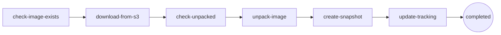

import Callout from '../../components/Callout.astro';

## How I Got Here

A fly.io take-home is what dropped this on my desk. Without that excuse, I would probably have kept happily typing `docker run` for another year. The take-home is the reason I learned this — but the learning itself is portable, which is what this post is about.

The shape of the work was small. Roughly: pull a container image from S3, unpack it into a devicemapper thinpool, snapshot the thin volume to "activate" it, track everything in SQLite, and drive the whole thing with the [FSMv2 library](https://github.com/superfly/fsm) that powers `flyd`. Hostile-environment assumptions throughout.

I passed and moved to the next round. So this is not a war story about failure. It is a debrief on what the work actually teaches you about how containers and orchestrators are built — written for the version of me who, a month earlier, still half-believed Docker was magic.

If you have ever typed `docker run alpine` and felt a vague unease about what just happened, this one is for you.

## What Is Actually In a Container Image

Open any image tarball. Inside, you will not find a "container." You will find:

- A `manifest.json` (or OCI `index.json`) describing layers.
- A `config` JSON blob: env vars, entrypoint, working dir.
- N layer tarballs, each one a diff of files added/removed/changed against the previous layer.

That is it. A container image is a tar of tars plus a JSON map. There is no runtime, no sandbox, no kernel feature embedded. The image is inert.

The task says "unpack into a canonical filesystem layout." Translation: take those layers, apply them in order on top of each other, and end up with a directory tree that looks like a Linux root. Tar over tar. The "filesystem" is whatever you have once the last layer is extracted.

<Callout type="note">
The task nudges hard with *"Think carefully about the blobs you're pulling from S3 and what they mean."* Some blobs are Docker v1, some OCI, some `repositories` files, some manifests with sha256-digest filenames you have to dereference yourself. The unpacker has to figure out what it is looking at without trusting the tag.
</Callout>

So far, no kernel involved. A Python script could do this. The interesting part is *where* you unpack to.

## Devicemapper, Thinpools, and Why Anyone Cares

You could untar the image into a regular directory. Docker did that for years with the `vfs` driver. It is the slowest, dumbest, most-correct option.

A serious orchestrator does not. It unpacks into a **thin volume** carved out of a **devicemapper thinpool**. The magic incantation:

```bash
fallocate -l 1M pool_meta
fallocate -l 2G pool_data

METADATA_DEV="$(losetup -f --show pool_meta)"
DATA_DEV="$(losetup -f --show pool_data)"

dmsetup create --verifyudev pool --table \
  "0 4194304 thin-pool ${METADATA_DEV} ${DATA_DEV} 2048 32768"
```

Six lines. Worth dissecting, because if you do not understand them, the rest of the challenge is impossible.

**`fallocate`** reserves disk space without writing zeros. Two files: `pool_meta` (1 MB, holds the block allocation map) and `pool_data` (2 GB, holds actual data blocks).

**`losetup -f --show <file>`** binds a file to a loop device — a `/dev/loopN` block device backed by that file. The kernel now treats the file as if it were a disk. (In production you use real block devices. The loop trick is for laptops and EC2 boxes.)

**`dmsetup create`** is the load-bearing line:

```bash
dmsetup create pool --table "0 4194304 thin-pool ${meta} ${data} 2048 32768"
```

It says: *create a device-mapper target named `pool`, mapping sectors 0 through 4,194,304 (= 2 GB at 512 bytes/sector), of type `thin-pool`, using `${meta}` for metadata, `${data}` for data, with a block size of 2048 sectors (1 MB) and a low-water mark of 32,768 blocks.*

A **thinpool** is a block of storage that hands out **thin volumes** on demand. The volumes look full-sized to whatever uses them, but blocks are only allocated on first write. You can create a 100 GB thin volume on a 2 GB pool and it costs you nothing — until something actually writes.

Two things make this magical for an orchestrator:

1. **Snapshots are basically free.** A snapshot of a thin volume is just another thin volume that shares blocks with the parent. Copy-on-write at the block layer. That is how an image becomes a runnable VM rootfs in milliseconds — the snapshot is metadata, not data.
2. **Density.** One physical host can carry thousands of thin volumes derived from a few base images. Shared blocks stay shared until something writes.

This is the primitive that makes per-customer-VM hosting affordable. Nobody invented it recently. Devicemapper thin provisioning has been in mainline Linux since 2011. Docker shipped the `devicemapper` storage driver in 2013. The contribution of a modern orchestrator is choosing it deliberately and building everything else around its guarantees.

So "unpack the image into a thinpool device, then snapshot it to activate" is, in miniature, the storage layer of a real fleet host.

## What My Code Actually Does

The Go binary auto-discovers `*.tar.gz` keys under `images/` in the configured S3 bucket and feeds each one to the FSM. For each image, it runs six transitions:



The two `check-*` transitions are why the task says "only if it hasn't been retrieved already" / "only if that hasn't already been done." Idempotency. If the box reboots mid-run, the FSM picks up where the SQLite row says it was, not where the goroutine thought it was.

In `unpack-image`, the meat:

```go
devicePath, err := deps.DeviceMapper.CreateThinVolume(req.Msg.ImageID, 1024)
// dmsetup message <pool> 0 "create_thin <id>"
// dmsetup create pool-<imageID> --table "0 <sectors> thin <pool> <id>"

deps.DeviceMapper.FormatVolume(devicePath)        // mkfs.ext4
mountPoint, _ := deps.DeviceMapper.MountVolume(devicePath, req.Msg.ImageID)
deps.ImageUnpacker.ExtractImage(imagePath, mountPoint)  // tar over tar
deps.DeviceMapper.UnmountVolume(mountPoint)
```

Then `create-snapshot` runs:

```bash
dmsetup message pool 0 "create_snap <new_id> <parent_id>"
dmsetup create pool-<imageID>-snapshot --table "0 <sectors> thin <pool> <new_id>"
```

The first line tells the pool to allocate snapshot metadata sharing blocks with the parent. The second exposes it as `/dev/mapper/pool-<imageID>-snapshot`. That is the "activation."

Output snippet from a clean run:

```
Unpacked container image to thin volume - analyzed blob structure
  config_digest=sha256:87bfd6...  container_format=OCI  has_manifest=true
  layers=1  size=4163354  device_path=/dev/mapper/pool-alpine-3.22.1
Created snapshot for image activation
  snapshot_path=/dev/mapper/pool-alpine-3.22.1-snapshot
Image processing completed successfully
```

No daemon. No Docker. Six `dmsetup` calls, one `mkfs`, one `tar -x`, three SQLite updates. That is a container image becoming a runnable rootfs.

## Why the FSM Is the Whole Point

I will be honest: when I first read the task, the FSM requirement felt like ceremony. I had a working version using goroutines, channels, and a retry loop in about ninety minutes. It looked clean. It also could not survive a reboot.

The FSMv2 library forces you to declare:

```go
fsm.Register[Req, Resp](manager, "process-container-image").
    Start("check-image-exists", checkImageExists).
    To("download-from-s3", downloadFromS3).
    To("check-unpacked", checkImageUnpacked).
    To("unpack-image", unpackImage).
    To("create-snapshot", createSnapshot).
    To("update-tracking", updateTracking).
    End("completed").
    Build(ctx)
```

Each transition is a pure function from request → response. State is persisted between transitions. If the host crashes during `unpack-image`, the next process restart finds the run at "check-unpacked completed, unpack-image pending" and resumes. Every transition gets a `run_id` and a `transition_version` (a ULID, monotonic, sortable), which means you get a full audit log for free:

```
transition=check-image-exists   transition_version=01K4N3H6NY6MVJYMVS4TH1Q268
transition=download-from-s3     transition_version=01K4N3H6P2RS7J4Z5J8GDN25KE
transition=unpack-image         transition_version=01K4N3H9WPDJCP2KGA91DMP0TR
transition=create-snapshot      transition_version=01K4N3HAKKSCD8SGHBS4HYBQ71
```

This is not logging-as-an-afterthought. This is the telemetry the orchestrator runs *on*. Each of those lines is one row in SQLite that another process can read to answer "what is this host doing right now?" without ever talking to the running binary.

That is the shift the challenge forces. **At fleet scale, your orchestrator is not the goroutine. It is the durable record of states the goroutine left behind.** Goroutines die. SQLite rows do not.

## The Hostile Environment Clause

The single most important sentence in the task:

> Assume we are going to run your code in a hostile environment.

This rewires how you write every function. Concretely, what it cost me:

- **Path validation everywhere.** `..`, `//`, non-absolute paths all rejected. Image IDs constrained to `[A-Za-z0-9._-]{1,200}`.
- **Error sanitization.** Real error strings can leak `/var/lib/...` paths. The `sanitizeErrorMessage` helper strips long path-looking tokens before anything goes into the SQLite log.
- **Idempotent dm operations.** `volumeExists` check before `dmsetup create`. A mutex on the `DeviceMapper` struct because two transitions racing on the same pool is a kernel-level mess.
- **S3 missing keys are a normal case.** Blobs you have never seen may show up later. Treat 404 as a first-class outcome, not a panic.
- **Validation of unpacked content.** A malicious tarball can ship `/etc/shadow` or symlinks pointing out of the mount root. The unpacker validates extracted layout before declaring success.

I do not know which of these mattered most to the reviewer. I do know that the challenge rewards paranoia and punishes "happy path only" code, and the bar is calibrated for people who already think this way.

## Reproducing It on a VM

The repo ships a Terraform module that brings up an Ubuntu 24.04 EC2 box (t3.small, 30 GB gp3, github-keys-fed SSH) and a `setup-thinpool.sh` that installs Go via Nix, the AWS CLI, sqlite3, and creates the loop-backed thinpool. End to end:

```bash
cd deploy/terraform && terraform init && terraform apply
rsync -avhPz --exclude 'deploy/' . ubuntu@<IP>:/home/ubuntu/fly.io/154428
ssh ubuntu@<IP>
sudo bash scripts/setup-thinpool.sh
CGO_ENABLED=1 go build -o image-processor
sudo ./image-processor
```

A 2 GB thinpool on an EC2 box can hold half a dozen real images (alpine, python:alpine, golang:alpine, ubuntu:24.04, two ksctl images) with snapshots. Real fleet hosts run the same primitives on real NVMe. Same `dmsetup` calls. More zeros.


## What I Actually Learned

Containers are not magic. A container image is a tar of tars. A "container filesystem" is an ext4 on a thin volume on a thinpool. "Activating" an image is `dmsetup create_snap`. Every primitive in this stack has been shipping in mainline Linux for over a decade.

What a serious orchestrator builds is *not* a new abstraction. It is a careful composition: thinpools for storage density, snapshots for fast activation, a persistent state machine for crash-safe orchestration, ULID-versioned transitions for auditability, SQLite as the source of truth on each host. None of those parts are exotic. The discipline is in choosing them and refusing to add anything else.

So `flyd` — the thing this miniature models — is a program that knows what state your thin volume is in, knows what state it should be in, and walks the diff. That is the orchestrator.

The next time you `docker run`, you can picture the thinpool. And the next time someone tells you their orchestrator is "magic," you can ask which transition they are stuck on.
