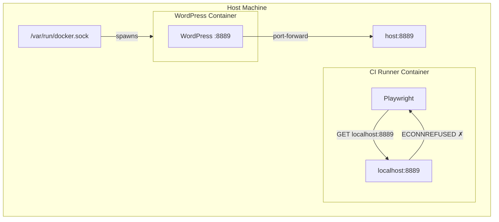
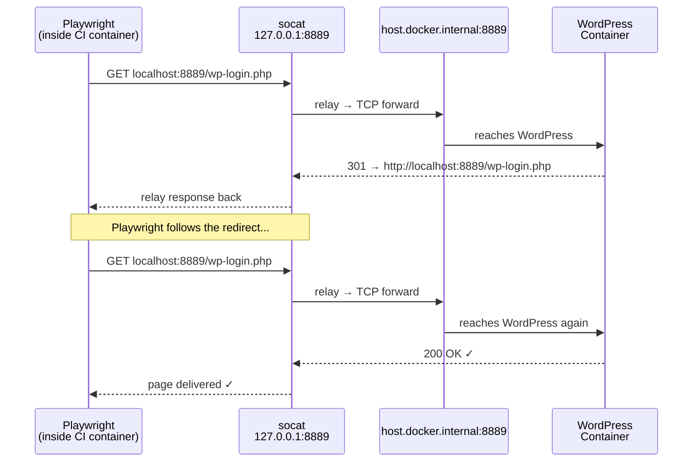

import Callout from '../../components/Callout.astro';

The tests pass locally. Of course they do.

Then you push to the repo. The self-hosted CI runner picks it up. Playwright spins up, reaches for WordPress at `localhost:8889`, and immediately dies with `ECONNREFUSED`.

The WordPress container is running. The port is forwarded. Nothing looks wrong — and that's exactly the problem.

---

## The Setup That Made Sense (Until It Didn't)

The architecture was straightforward: a GitHub Actions self-hosted runner running *inside* a Docker container, with `/var/run/docker.sock` volume-mounted so it can spin up sibling containers. One of those siblings is a WordPress instance for E2E testing — exposed on port 8889.

```
Host Machine
├── CI Runner Container  ← your GitHub Actions workflow runs here
│   └── /var/run/docker.sock mounted from host
└── WordPress Container  ← spun up via docker.sock
    └── port 8889 → forwarded to host:8889
```

Playwright lives inside the CI runner container. It needs to hit WordPress on port 8889. On paper, this should work.



---

## Error One: Connection Refused

```
Error: connect ECONNREFUSED 127.0.0.1:8889
```

Here's the thing about containers that burns you eventually: **each container has its own network namespace.** Its own loopback. Its own `127.0.0.1`.

When Playwright inside the CI runner container asks for `localhost:8889`, it's asking that container's loopback — which knows nothing about what the host machine is listening on. WordPress's port forward goes to the *host's* port 8889. From inside the container, that might as well be on another planet.

This is Docker working exactly as intended. It's also deeply annoying when you forget.

---

## Fix Attempt One: `--add-host=host.docker.internal:host-gateway`

The standard answer to "container needs to talk to the host" is `--add-host=host.docker.internal:host-gateway`. It injects a DNS entry into the container that resolves `host.docker.internal` to the host machine's gateway IP — available since Docker 20.10 via the special `host-gateway` magic string.

In the GitHub Actions workflow, you add it to the container options:

```yaml
container:
  image: your-ci-runner-image
  options: --add-host=host.docker.internal:host-gateway
```

Now the CI container can reach `host.docker.internal:8889`. That's the WordPress container, via the host's port forward. You update the Playwright base URL, run the tests — and hit a different wall.

---

## Error Two: WordPress Redirects to Itself

WordPress has strong opinions about its own identity. It stores the canonical site URL in the `wp_options` table — `siteurl` and `home` — and it uses those values for redirects. If WordPress was configured to serve at `localhost:8889`, that's where it tells browsers to go, no matter what hostname you used to reach it.

So when Playwright hits `host.docker.internal:8889`, WordPress accepts the connection — and immediately 301s back to `localhost:8889`.

```
→ GET http://host.docker.internal:8889/wp-login.php
← 301 http://localhost:8889/wp-login.php

→ GET http://localhost:8889/wp-login.php
← ECONNREFUSED
```

Playwright follows the redirect like a good HTTP client. Back to `localhost`. Back to nothing. You're in a loop.

This is the moment you stare at the logs, read them again, and quietly question your life choices.

---

## The Actual Problem (Stated Plainly)

Playwright and WordPress don't agree on what `localhost:8889` means.

WordPress thinks `localhost:8889` is itself. Playwright, inside the container, thinks `localhost:8889` is the container's own loopback — which is listening on nothing.

You can't change WordPress's expectations easily (they're baked into the database). You can't change Playwright's behavior without fighting the tool. What you *can* do is make `localhost:8889` inside the container actually go somewhere useful.

---

## Enter socat

`socat` — short for *SOcket CAT* — is a relay. It listens on one address and forwards connections to another. It's been around since the early 2000s, it's in every Linux package repo, and it does this one thing without ceremony.

The command that fixes the problem:

```bash
socat TCP4-LISTEN:8889,fork,bind=127.0.0.1 TCP4:host.docker.internal:8889 &
```

Breaking it down:

| Part | What it does |
|---|---|
| `TCP4-LISTEN:8889` | Listens for IPv4 TCP connections on port 8889 |
| `bind=127.0.0.1` | Binds only to localhost (not all interfaces) |
| `fork` | Spawns a child process per connection — handles concurrent requests without dropping the listener |
| `TCP4:host.docker.internal:8889` | Forwards each connection to the host's port 8889 |
| `&` | Runs in the background so your test suite can start |

Now when Playwright requests `localhost:8889`, socat intercepts it and transparently relays the connection to `host.docker.internal:8889` — which is WordPress. WordPress responds, redirects to `localhost:8889`, Playwright follows — and socat handles *that* request too.

Both sides are satisfied. Neither knows about the relay. The network namespace mismatch is invisible.



---

## The Full Workflow Step

```yaml
- name: Install socat
  run: apt-get install -y socat   # or yum/apk/whatever your image uses

- name: Run E2E Tests
  run: |
    # Bridge localhost:8889 in this container to WordPress on the host.
    # Playwright and WordPress both expect "localhost:8889" — socat makes that true.
    socat TCP4-LISTEN:8889,fork,bind=127.0.0.1 TCP4:host.docker.internal:8889 &

    sudo -u wpuser env "PATH=$PATH" "PLAYWRIGHT_BROWSERS_PATH=$PLAYWRIGHT_BROWSERS_PATH" \
      npm run test:e2e
```

<Callout type="tip" title="Prerequisites">
Two prerequisites: `socat` installed in the CI runner image (`apt-get install -y socat`) and `--add-host=host.docker.internal:host-gateway` in your container options. The latter requires Docker 20.10+.
</Callout>

Together, they close the loop: the host gateway gives you a route to the host, and socat makes `localhost` in the container mean the right thing.

---

## The Debugging Checklist

Next time you hit `ECONNREFUSED` in a containerized CI environment with port-forwarded services:

1. **Confirm where the service is actually running.** `docker ps` and `docker inspect` on the host. Is it bound to `0.0.0.0` or just `127.0.0.1`?
2. **Identify your test runner's network namespace.** If it's inside a container, its `localhost` is isolated.
3. **Add `--add-host=host.docker.internal:host-gateway`** to your runner container options. Verify with a quick `curl host.docker.internal:PORT` in the workflow.
4. **Check what the service redirects to.** If it redirects back to `localhost`, the hostname approach breaks. You need socat.
5. **Add socat as a background forwarder** before tests run. One line, then let your test suite go.

---

## What This Is Really About

The bug wasn't in your tests. It wasn't in WordPress. It wasn't even in Docker.

It was in the assumption that `localhost` means something universal — that it's a shared concept across processes and containers and hosts. It isn't. `localhost` is always relative to where you're standing. Containers are designed to make that isolation complete.

`--add-host` punches a hole through the isolation to let you reach the host. socat makes the other side of that hole look like `localhost`. Used together, they're not hacks — they're Unix composition working the way it's supposed to.

socat has been forwarding sockets since before half the infrastructure tooling in your stack existed. It still does it better than most alternatives. That's worth knowing.

---

*Next time the CI log says `ECONNREFUSED` and everything looks fine — check where you're standing. You might be on a different `localhost` than you think.*
