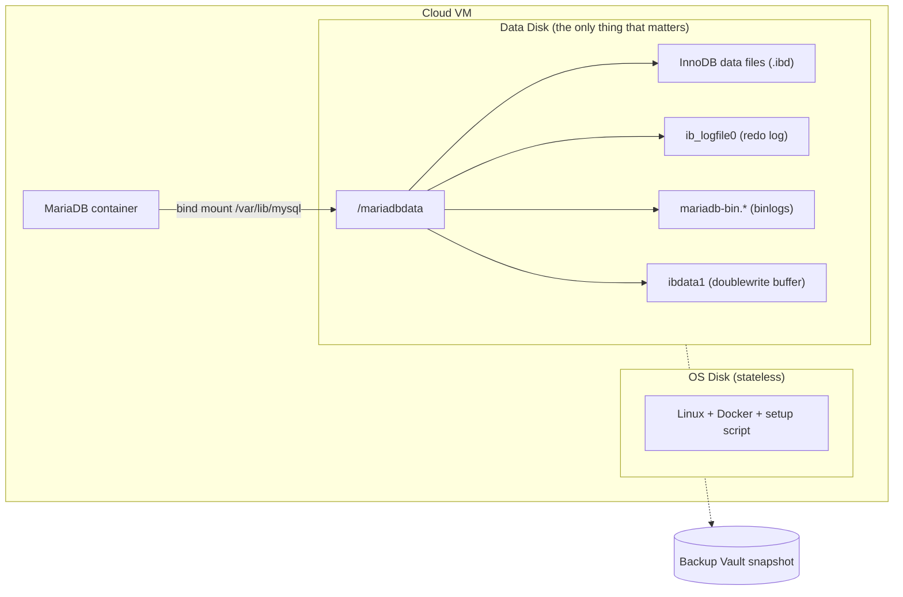
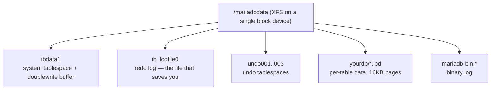
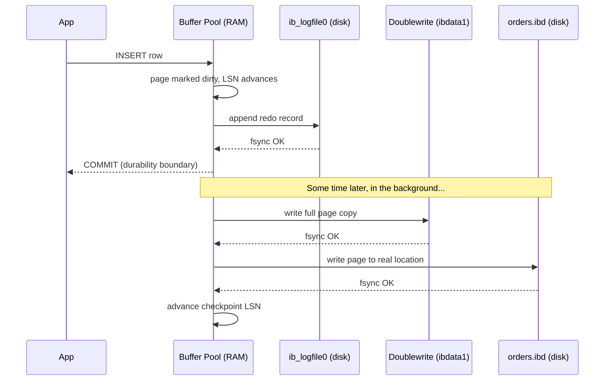

import Callout from '../../components/Callout.astro';

Every MariaDB self-hosting guide opens the same way: install `mariadb-backup`, set up cron, write a restore runbook. I followed that script for months. Then I deleted most of it.

This post is the path from "logical backups, full restores, cron everywhere" to "snapshot a disk, attach it, done." I was running MariaDB 11.8 LTS on a cloud VM (Azure, in this case), Docker Compose, single primary plus a read replica. Around 1TB of InnoDB on a Premium SSD data disk. The story isn't about the cloud — it's about the assumption I kept dragging around: *the database has to do its own backups.* Turns out it didn't.

## Stage 1 — Learning the words

Before any of this, I had to learn the vocabulary. If you've never set up replication, three things deserve to live rent-free in your head.

**InnoDB** is MariaDB's transactional storage engine. Every write goes through a redo log (`ib_logfile0`) and a doublewrite buffer before it lands in the actual data file. That's why an InnoDB instance can survive a hard kill — on next boot, it replays the redo log and you're back. This matters more than it sounds; the rest of the post leans on it.

**Binlog** (binary log) is the ordered stream of every change made on the server. Replicas pull from it. It's also what point-in-time recovery uses.

**GTID** (Global Transaction ID) is a stable identifier for every transaction across the cluster. The old way of pointing a replica at a primary was to copy a `(log_file, log_pos)` tuple — fragile, off-by-one prone. With GTID, you set `gtid_slave_pos` to "I've seen up to here" and let replication figure out where to resume.

```sql
CHANGE MASTER TO
    MASTER_HOST='primary',
    MASTER_USER='repl',
    MASTER_PASSWORD='...',
    MASTER_USE_GTID=slave_pos;
```

That's the whole replication contract once you've got the data over. The hard part is "got the data over."

## Stage 2 — The mariadb-backup era

The textbook approach for cloning a primary is `mariadb-backup`. Take a hot, physical backup. `--prepare` it (apply the redo log so the files are consistent). Move it to the replica. Set `gtid_slave_pos`. `START REPLICA`. Done.

```bash
mariadb-backup --backup --target-dir=/backup/full/ --parallel=16 --throttle=2000
mariadb-backup --prepare --target-dir=/backup/full/
```

It works. For 100GB+ it's a few hours of disk I/O on the primary, but it's a known shape.

The traps showed up later:

- **Super-user grants travel with the backup.** The `mysql` system database comes along. The replica boots with the primary's `auto.cnf`, and unless you delete it, both servers think they're the same UUID. Tiny detail, big mess.
- **Partial backups are a lie at scale.** You can pass `--databases="X"`, but InnoDB's shared `ibdata1` and the redo log span the whole instance. Restoring "just one DB" doesn't really work. Always full.
- **`--copy-back` at restore time is slow.** You back up to disk A, then copy back to disk B. For 1TB that's another long pass. You feel it most when you're trying to bring a replica up under time pressure.

So far, manageable. Then I had the idea that ruined my month.

## Stage 3 — The incremental nightmare

"What if I take a full backup once a week and incrementals every few hours?" Reasonable. Cheap on disk. Standard practice.

Then the questions started.

Where do the incrementals live? On a separate disk, or shipped off the box? If shipped, what's the auth story? If local, when do I rotate? When does an incremental chain become long enough that restore is "full + N incrementals applied in order, hope none are corrupt"? Where do I look to confirm last night's backup actually ran? What dashboard? Whose pager? What happens when I add a node?

Each cron job became a small product with an SLA. I was building a backup *service*, not protecting a database. And the recovery-time math kept getting worse, not better.

<Callout type="warning">
  When your backup pipeline needs its own backup pipeline, you're doing it wrong. The number of moving parts is the bug.
</Callout>

I stopped and asked: what's the simplest mechanism that could possibly capture "the bytes in `/var/lib/mysql` at time T"?

## Stage 4 — The reframe: separate the data disk

The OS disk holds Linux, Docker, my setup script. None of that is precious — I can rebuild it in 15 minutes. The data disk holds `/var/lib/mysql`. That's the *only* thing that needs to survive.

So I split them. OS on its own disk. A dedicated Premium SSD attached at LUN 9, mounted at `/mariadbdata`, bind-mounted into the container as `/var/lib/mysql`. (The backup disk later joins at LUN 11 — different role, different lifecycle.)



Three things fall out of this immediately:

1. **The data disk is portable.** Detach. Attach to another VM. Boot MariaDB. Same database. Brain transplant.
2. **Snapshot scope is small and obvious.** I snapshot only the disk that holds state. The OS isn't in the picture.
3. **IOPS provisioning gets honest.** I size the data disk for the database's actual workload. The OS disk stays cheap.

Once you can detach-and-reattach state, you've stopped writing a backup tool and started using a primitive the cloud already gave you.

## Stage 5 — Disk snapshots as the primary backup

Azure managed disk snapshots are agentless and incremental. The first one is a full copy; subsequent ones are deltas, and they live on Standard HDD regardless of the source SKU. Azure Disk Backup wraps this in a Backup Vault with retention policies, RBAC, and scheduling.

The hypervisor takes the snapshot. The VM doesn't notice. There's no `FLUSH TABLES WITH READ LOCK`, no I/O spike, no replication lag. For an OLTP workload that has to keep serving traffic, this is the meaningful difference: zero production impact.

But — *and this is the part I had to convince myself of* — the snapshot is **crash-consistent**, not application-consistent. From InnoDB's perspective, restoring a snapshot is identical to a power-cut. Boot, replay the redo log, doublewrite covers torn pages, you're up. This is what InnoDB was designed for. It is, quite literally, the thing it does best.

<Callout type="important">
  Crash-consistent on Azure means write-order preserved within a single disk. That's why having data, binlogs, and redo log all on the *same* data disk matters. If they were spread across disks, the snapshot wouldn't necessarily preserve write-order across them.
</Callout>

Restore is detach-attach. Restore from the vault → new managed disk → attach to a VM at LUN 9 → start MariaDB. For ~100GB this is minutes. The replica gets the same treatment: create another disk from the same snapshot, attach to the replica VM, boot, then re-link replication. Because the GTID is baked into the data files, `SELECT @@gtid_binlog_pos` on the booted replica tells you exactly where to resume:

```sql
SELECT @@gtid_binlog_pos;
-- e.g. "0-1-2653459"

STOP REPLICA;
RESET REPLICA;
SET GLOBAL gtid_slave_pos = '0-1-2653459';
CHANGE MASTER TO
    MASTER_HOST='<primary>',
    MASTER_USER='repl',
    MASTER_PASSWORD='...',
    MASTER_USE_GTID=slave_pos;
START REPLICA;
```

No log file. No log position. One value out of the data files. Both nodes from the same snapshot means GTID can't diverge.

## Stage 6 — mariadb-backup, demoted

I didn't throw `mariadb-backup` away. I just stopped asking it to be the primary defense. It now runs on a *dedicated backup disk* mounted at `/mariadbbackup`. The trick that made this fast: write the backup directly to the root of that disk, then `--prepare` it in place.

```bash
mariadb-backup --backup --target-dir=/backup --parallel=4 --throttle=2000
mariadb-backup --prepare --target-dir=/backup --use-memory=1G
```

After `--prepare`, the backup disk *is* a bootable MariaDB data directory. Then I trigger an Azure ad-hoc snapshot of *that* disk into the same Backup Vault.

| Step | Traditional | This setup |
|---|---|---|
| `--prepare` | At restore (10–30 min for 1TB) | At backup time, already done |
| `--copy-back` | At restore (30–60 min for 1TB) | Eliminated — backup disk *is* the datadir |

Restore from this path is the same procedure as Stage 5: pull the backup disk from the vault, attach it at LUN 9 (it *becomes* the data disk now), boot. One subtlety: `--prepare` resets the binlog, so `@@gtid_binlog_pos` is empty after boot. The GTID lives in `mariadb_backup_binlog_info` instead. On the primary, run `RESET MASTER` then `SET GLOBAL gtid_binlog_state = '<gtid>'` from that file so new transactions continue from the right place; replicas link with the same GTID via `gtid_slave_pos`. There's nothing left to copy. It's a defense-in-depth path that's independent of the primary snapshot chain — different disk, different backup instance, different recovery point — but uses the exact same restore mechanism. Two parallel paths, one workflow.

## The config knobs that earned their keep

Self-hosting forces you to actually read `my.cnf`. A managed offering hides this. Here's the short list of variables that stopped being trivia and started being load-bearing.

**`server_id`** — every node in a replication topology needs a unique integer. Sounds obvious until you clone a primary's data disk to a replica and forget to override it. Replicas with the same `server_id` as the primary will skip events that look like their own writes. Silent breakage.

**`read_only`** — keeps a replica from accepting writes from non-SUPER users. Two gotchas: (1) the replication thread is SUPER, so replication still applies, which is what you want; (2) `read_only` is also the lever in the controlled shutdown sequence on the primary — flip it ON, drain connections, *then* shut down. Don't forget to flip it OFF after a planned restart, or your application will keep getting "server is read-only" errors until someone notices.

**`log_bin` + `binlog_format=ROW`** — required on the primary for replication to exist at all. Not needed on a pure read replica (saves a chunk of disk I/O), but required if that replica might ever be promoted to primary. `ROW` format ships actual row changes rather than statements; safer for non-deterministic queries (think `NOW()`, `UUID()`).

**`gtid_strict_mode=ON`** — refuses to apply transactions out of GTID order. Catches replica drift early instead of letting it silently rot.

**`sync_binlog=1` + `innodb_flush_log_at_trx_commit=1`** — the durability pair. Forces an `fsync` on the binlog and the InnoDB redo log on every commit. Slower per-transaction, but it's what makes "the snapshot captures a committed transaction" actually true. Anything less and you're rolling the dice on the last second of writes.

**`innodb_doublewrite=ON` + `innodb_checksum_algorithm=full_crc32`** — the torn-page and silent-corruption pair. Doublewrite catches partial page writes during a crash; full_crc32 catches bit rot. Together they're why a crash-consistent snapshot is enough.

**`innodb_log_file_size`** — the default 96MB is wrong for anything past a few GB. For ~1TB OLTP, 2G is the standard. Bigger redo log = fewer checkpoints = less I/O pressure = cleaner state when the snapshot fires.

**`innodb_buffer_pool_size`** — usually around 70% of RAM on a dedicated DB box. Pair it with `innodb_buffer_pool_dump_at_shutdown=ON` and `innodb_buffer_pool_load_at_startup=ON` so a freshly-restored replica isn't cold for an hour.

**`max_allowed_packet`, `wait_timeout`, `net_read_timeout`** — the boring networking knobs. The defaults are tiny. A lot of heavy ORMs ship large packets and hold idle connections; if you don't bump these, you'll chase ghosts in the application logs that are really just MariaDB politely closing the door.

None of this is exciting. All of it is the difference between a database that survives a bad day and one that needs a postmortem.

## Under the hood: what a "snapshot" actually is

I'm a systems person. "Snapshot" felt like magic for too long. Let me unpack it from the bottom up — because once you see it, the whole architecture above stops feeling like a leap of faith.

### The block device underneath

Your Premium SSD shows up to Linux as a block device — `/dev/sdc` or `/dev/nvme0n1`. To the kernel, it's just an array of fixed-size blocks (4 KiB each on modern disks) that supports two operations: read block N, write block N. Everything above this is layered fiction.

That "disk" isn't a physical drive somewhere. It's a virtual block device backed by Azure's storage layer — internally, append-only stream/extent storage spread across many physical drives, replicated three ways within a region. To Linux it's indistinguishable from local NVMe.

### XFS gets you files; InnoDB gets you pages

XFS sits on those blocks and gives you filenames, inodes, and a journal. The journal protects *filesystem* metadata — it does **not** protect application data. If MariaDB writes a 16KB InnoDB page and the system loses power halfway, XFS may have written 4KB and lost the rest. XFS is fine. The page is *torn*.

Inside `/mariadbdata`, InnoDB lays out:



### The write path, in slow motion

When a row gets inserted, here's the exact dance:

1. **Modify the page in RAM** (the buffer pool). Disk untouched. Page is now "dirty," and its log sequence number (LSN) advances.
2. **Append a redo record** to `ib_logfile0` and `fsync()`. With `innodb_flush_log_at_trx_commit=1`, this fsync blocks until storage hardware confirms durable write.
3. **Return COMMIT** to the client. *This is the durability boundary.* The data file on disk is still stale.
4. **Background flush, eventually.** A worker thread writes the dirty page first to the **doublewrite buffer** in `ibdata1` (with fsync), then to its real location in the `.ibd` file (with fsync), then advances the checkpoint LSN.

The redo log is a circular buffer: once a page has been flushed past the checkpoint, the redo bytes that produced it are reusable.



### The torn-page problem and why doublewrite fixes it

Redo records are *deltas*. They say "on page X, change byte Y from A to B." If the base page is torn, the delta has nothing coherent to apply to. So InnoDB writes every dirty page **twice**:

- Crash during the doublewrite write → real page on disk is intact, redo replays cleanly.
- Crash during the real-file write → real page is torn, but the doublewrite buffer holds a complete copy; recovery copies it back, then redo replays.

This is why `innodb_doublewrite=ON` is non-negotiable for snapshot-based recovery.

### What a snapshot actually captures

Now the trick. A managed-disk snapshot is **not** a copy of your 1TB. It's a metadata operation that records "at time T, block B held content C" — implemented as copy-on-write (or redirect-on-write, depending on the backing store) so that subsequent writes to the live disk preserve the old block elsewhere before overwriting. The first snapshot's *billed* size is the full disk; subsequent incremental snapshots bill only the delta blocks since the previous snapshot.

The atomic guarantee: every block on the disk reflects the state at exactly the snapshot instant. No half-blocks. Within a single disk, write order is preserved. *Across* disks, no such guarantee — which is why everything (data, redo log, doublewrite, binlogs) lives on **one** disk.

When you restore that snapshot, what you get is byte-identical to what would have been on the live disk if someone yanked the power cord at the snapshot instant. Different pages at different LSNs, doublewrite buffer in some intermediate state, redo log ahead of all of them. **That's the same state every InnoDB instance has seen after every crash for the last twenty years.**

### Crash recovery, once more with feeling

On boot, InnoDB:

1. Opens `ib_logfile0`, reads the last checkpoint LSN, finds the end of the log.
2. **Doublewrite scan.** Cross-checks doublewrite copies against real pages, repairs any torn ones.
3. **Redo phase.** Walks the log from checkpoint to end. For each record, if the target page's LSN is older than the record's, apply it; otherwise skip.
4. **Undo phase.** Any transaction that was in flight (not committed) at snapshot time gets rolled back via the undo logs.
5. Writes a fresh checkpoint, opens for connections.

The whole thing is usually seconds to a minute, because `innodb_flush_log_at_trx_commit=1` keeps the log tight against the data files.

### Why mariadb-backup's `--prepare` is the same algorithm

This is the part that made it click for me. `mariadb-backup --backup` copies data files page-by-page over hours while simultaneously *tailing* the redo log into `xtrabackup_logfile`. The copied files are at different LSNs (inconsistent), but the captured redo contains every change during the copy window.

`--prepare` is then literally InnoDB crash recovery, run offline against the backup directory. Same redo replay, same undo rollback, same checkpoint. The only difference from snapshot recovery: it runs against a *copy* before that copy becomes production, so a failure isn't catastrophic.

Snapshot + boot vs `--backup` + `--prepare` are two paths to the same destination. The snapshot path is faster because the hypervisor captures the state atomically in milliseconds; mariadb-backup synthesizes the same kind of state over hours of live copying.

### And then there's Aurora

Worth noting because it shows the limit of where this thinking goes. Aurora doesn't do crash recovery on restore. It can't — there's nothing to recover *from*.

Aurora pushed the redo log into the storage layer. The database engine writes **only** redo records (no data pages, no doublewrite, no binlog fsync) to a distributed storage fleet: 6 copies of every redo record across 3 AZs, write quorum 4/6, read quorum 3/6, with each volume sliced into 10GB protection groups. Storage nodes apply redo to their local page copies continuously and serve materialized pages on demand.

Consequences:

- No torn pages — redo records are small enough to fit in a single atomic write.
- No backups in the traditional sense — a "snapshot" is just a marker in the redo stream.
- Replicas read from the *same* storage; they don't hold a separate data copy.
- Repair is per-10GB segment, not per-1TB volume — a dead node rejoins in under a minute.

That's the move cloud providers make at the deep end of the pool: don't optimize the backup, eliminate the need for one. For self-hosting, you don't get that lever — but you do get the same primitives one layer up. Snapshot the disk. Let InnoDB do what it was designed to do.

## The unglamorous bits that hold it up

A few details I kept tripping over until I got them right.

**Shutdown is not just `docker compose down`.** SIGTERM kills client threads in arbitrary order. On a primary, that includes binlog dump threads — meaning a transaction can commit on the primary but never reach the replica. The right sequence is: `SET GLOBAL read_only = ON`, drain active connections, then `SHUTDOWN WAIT FOR ALL REPLICAS` so binlog dump threads stay alive until replicas catch up. Add `docker update --restart=no db` before the SQL shutdown, otherwise Docker's `restart: unless-stopped` will yank the rug.

**Docker waits for the mount.** A `docker.service.d` drop-in with `Requires=mariadbdata.mount` and `After=mariadbdata.mount` keeps Docker from racing the data disk on boot. If MariaDB starts on an empty `/mariadbdata`, it cheerfully initializes a fresh database on top of nothing. Don't do that to yourself.

**InnoDB tuning that pays for itself on a snapshot-restore world.** `innodb_flush_log_at_trx_commit=1`, `sync_binlog=1`, `innodb_doublewrite=ON`, `innodb_checksum_algorithm=full_crc32`, a generously sized `innodb_log_file_size` (2G for ~1TB), and the buffer-pool dump/load pair. That config is what makes "boot from a crash-consistent snapshot" boring instead of scary.

**One disk for state. Period.** If you start putting binlogs on a separate "log disk" for IOPS reasons, your snapshots stop being a complete picture. The cleaner answer is to size the data disk's IOPS for the combined workload.

## Stage 7 — The hour you didn't lose

Hourly snapshots are great until the bad event happens at 14:23 and the snapshots sit at 14:00 and 15:00. Restoring 14:00 throws away twenty-three minutes of perfectly good writes. Restoring 15:00 brings the bad event back with it. The honest version of "we have backups" should let you land *between* the snapshots, on a specific transaction.

My first instinct was to snapshot more often. Azure has opinions about that: Backup Vault disk policies are one-hour minimum, and managed disks cap at five hundred incremental snapshots per source. Going sub-hourly means hand-rolling `az snapshot create` from a runbook, with its own monitoring and retention math — the same backup-service-that-needs-a-backup-service trap I'd just crawled out of in Stage 3.

My second instinct was to stream binlogs to blob storage. It works, but it adds a streamer process, a lifecycle policy, and a separate restore step. The wrong size of hammer for the RPO I actually have.

The reframe was hiding in plain sight, again: **the binlogs are already on the data disk.** Every snapshot the Vault takes already contains them, alongside InnoDB. With seven-day binlog retention, every snapshot quietly ships a week of replayable history. I didn't need new infrastructure. I needed a procedure.

The shape of that procedure is two snapshots and a timeline.

```
              T0 (snap)         T_target          T_bad           T1 (snap)
                │                   │                │                │
   ─────────────┼───────────────────┼────────────────┼────────────────┼─────►
                ▲                   ▲                                 ▲
            InnoDB state        want to land                     binlogs covering
            base for replay     here (just before                [T0 .. T1]
                                the bad event)
```

Pick `T_target` — the moment just before things went wrong. Take the snapshot before it (`snap_T0`) and the snapshot after it (`snap_T1`). Each plays a different role. `snap_T0` becomes the **state base**: restore it, boot it, leave it `read_only=ON`. `snap_T1` is just a **binlog donor**: restore it to a scratch VM, mount it **read-only**, copy out the binlog files, discard the disk. Then on the booted base, replay the binlogs from the position you booted at, up to `T_target`. Promote out of read-only. Rebuild replicas from the new primary. That's the whole thing.

It works because three guarantees line up. The snapshot is crash-consistent, so InnoDB recovery on the booted base produces the exact state at `T0` — same trick as Stage 5. `sync_binlog=1` and `innodb_flush_log_at_trx_commit=1` make every committed transaction durable before COMMIT returns, so the binlog inside the snapshot reflects everything the application believes happened. And `binlog_format=ROW` plus `gtid_strict_mode=ON` make the replay deterministic — ROW ships actual row changes (so `NOW()` and `UUID()` don't drift), strict GTID rejects anything out of order.

The interesting question is where to stop. `--stop-datetime` resolves to one second, and if two transactions share a second you'll over- or under-shoot. So I always inspect first:

```bash
mariadb-binlog --base64-output=DECODE-ROWS --verbose \
  /tmp/replay/mariadb-bin.0000{42..47} > /tmp/inspect.sql
```

Out comes a readable transcript:

```
# at 12345
#260430 14:22:58 server id 1  end_log_pos 12500  GTID 0-1-2653459 trans
BEGIN
... (last good transaction) ...
COMMIT/*!*/;

# at 12500
#260430 14:23:03 server id 1  end_log_pos 12780  GTID 0-1-2653460 trans
BEGIN
DROP TABLE customers   ← the bad event
COMMIT/*!*/;
```

`--stop-position=12500` is the cleanest cut: the byte offset of the bad event's start, applied to the last file in `argv`. Frame-perfect, no second-rounding. `--stop-datetime` is the fallback when you only have a wall-clock instant. `--exclude-gtids` is the surgical option when you want to keep almost everything and skip one specific transaction. `mariadb-binlog` always stops at transaction boundaries, so whichever flag you choose, the cut lands cleanly between BEGIN and COMMIT.

The replay itself is anticlimactic:

```bash
docker compose exec -T db sh -c '
  mariadb-binlog \
    --start-position='"$T0_POS"' \
    --stop-position=12500 \
    /tmp/replay/mariadb-bin.0000{42..47} \
  | mariadb -uroot -p"$MYSQL_ROOT_PASSWORD"
'
```

Two flags bit me on the first dry run, both worth flagging up front: `--start-position` applies *only to the first file in `argv`*; subsequent files are read from their start. `--stop-position` applies *only to the last file*. If you forget that and brace-expand a wide range carelessly, you'll silently re-apply transactions you didn't mean to.

<Callout type="important">
  If a file in `argv` contains pre-`T0` events because rotation straddled the snapshot, `gtid_strict_mode` silently skips already-applied GTIDs — `mariadb-binlog` preserves original identifiers, and the server recognizes the duplicates. Treat this as a safety net, not the plan. Still scope `--start-position` correctly. The skip stops working if the binlogs come from a different `domain-server_id` stream, and you'll get an error instead of a quiet skip.
</Callout>

A few honest limits worth naming. The smallest unit you can land on is a single transaction — that's the granularity of the binlog stream and it's almost always what you want, but it does mean PITR cannot split a multi-statement transaction in half. If `T_bad` is a destructive DDL like `DROP TABLE` and `T_target` is on the far side of it, the DDL is sitting in the replay stream waiting to ruin your day; you'd have to remove that event from the SQL output by hand before piping. And replay is single-threaded — a quiet OLTP hour replays in a few minutes, a busy one can take close to its real wall-clock duration. Plan the RTO accordingly.

PITR rides on the snapshot path, not the `mariadb-backup` path. The `mariadb-backup` disk is the failsafe for the day the Vault itself can't be trusted; when you're reaching for it, you've already lost the precision PITR was offering. Different tool, different bad day.

What I like about this whole arrangement is that I didn't *add* anything to make it work. Binlogs were already on the data disk because that's the only way the snapshot stays a complete picture. Commits were already durable because that's what makes "the snapshot captured a committed transaction" actually true. PITR is what those choices look like once you write down the procedure.

## Where I landed

I started looking for the right backup tool. I ended up looking for the right *disk*. Once `/var/lib/mysql` was a separable, snappable, attachable thing, the rest of the architecture got smaller and smaller. The database engine handles its own crash recovery — that's its job. The cloud provider handles cheap incremental block-level snapshots — that's its job. My job is to get out of the way and let those two things meet.

The complicated version of this was a backup service with cron, retention, dashboards, restore drills, and an "incremental chain" that I had to trust. The simple version is: state on its own disk, a vault that snapshots it, and a script that knows how to attach it somewhere new. `mariadb-backup` is still in the toolbox — as a failsafe with an independent recovery path — but it's no longer the load-bearing wall.

If you're staring at a checklist that says "must survive a bad day," start with that question: *what is the smallest thing that has to survive?* Put it on its own disk. The rest follows.

---

I've been wearing both the infra and the DB hat on this one, so it's entirely possible I've talked myself into a corner somewhere — a sharp edge I haven't hit yet, an assumption that doesn't hold at a different scale, a config knob I'm reading wrong. If you spot one, I'd genuinely like to hear about it — [drop a note in the discussion thread](https://github.com/dipankardas011/dipankardas-portfolio/discussions/8) and let's get into it.
